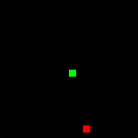
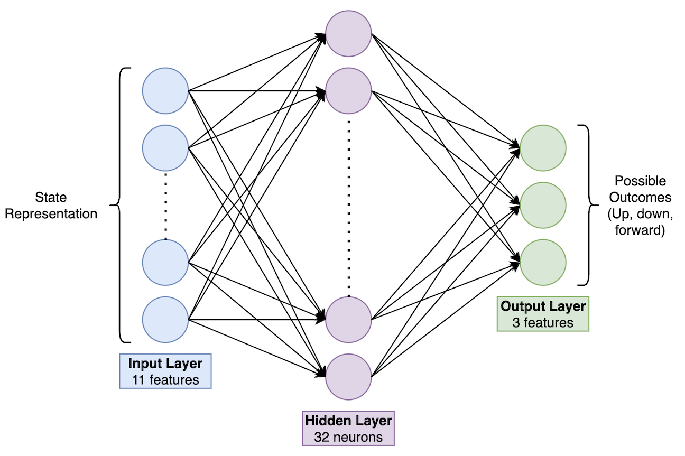
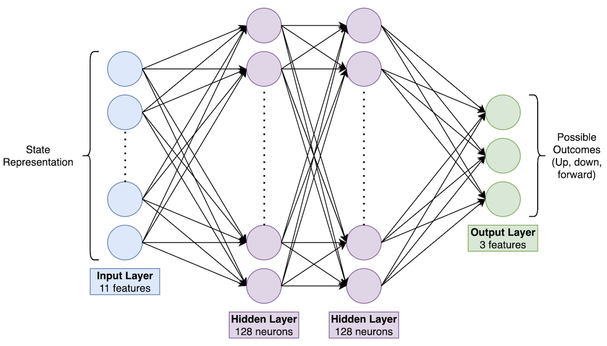

# Reinforcement Learning for Mastering Snake: An AI Approach to Classic Gameplay

This project uses Reinforcement Learning (RL) to train an AI agent to play the classic game of Snake, showcasing the potential of AI to learn and adapt to dynamic environments. It also highlights the critical role of neural network architecture and hyperparameter tuning in achieving optimal performance.

A well-designed neural network ensures the agent can effectively learn game dynamics, while proper hyperparameter configuration balances exploration and exploitation, ensuring stable and efficient training. This project demonstrates how thoughtful design and tuning are essential for success in reinforcement learning tasks.

## Description

This project applies Reinforcement Learning (RL) to train an AI agent to master the classic game of Snake. The AI learns to navigate the game environment, maximize its score by consuming food, and avoid collisions with walls or itself. By implementing RL algorithms such as Deep Q-Networks (DQN), the project explores how intelligent agents can develop strategies in dynamic, real-time environments through trial and error.

In addition to building a high-performing Snake-playing agent, this project emphasizes the importance of neural network architecture design and hyperparameter tuning in reinforcement learning. A well-structured neural network allows the agent to effectively interpret the spatial relationships within the game, while properly configured hyperparameters (e.g., learning rate, epsilon) ensure efficient and stable training. This is achieved by comparing performance between a model with poor architecture and learning parameters (BadSnake.py), and a model with good architecture and learning parameters (GoodSnake.py).

This project serves as both a demonstration of RL techniques and a hands-on exploration of AI's ability to adapt to challenges, offering insights into the interplay of algorithm design, neural network structure, and optimization in artificial intelligence.

The difference in neural network architecture and learning parameters for BadSnake and GoodSnake are listed below:

BadSnake:
- NN Architecture:
    - Input Layer: 11 features
    - Hidden Layer: 1 layer, 32 neurons
    - Output Layer: 3 actions



- Learning Parameters:
    - Learning Rate: 0.01
    - Discount Factor (Gamma): 0.5
    - Epsilon Decay: 1.0
    - Replay Memory Size: 500
    - Batch Size: 64
    - Target Model: Not used

GoodSnake:
- NN Architecture:
    - Input Layer: 11 features
    - Hidden Layers: 2 hidden layers, 128 neurons each
    - Output Layer: 3 actions



- Learning Parameters:
    - Learning Rate: 0.0001
    - Discount Factor (Gamma): 0.99
    - Epsilon Decay: 0.995
    - Replay Memory Size: 50,000
    - Batch Size: 64
    - Target Model: Updated after each episode


## Getting Started

### Dependencies

- Python 3.8 or higher
- pip package manager
- The following Python libraries (listed in requirements.txt):
  - pygame
  - numpy
  - torch
  - matplotlib

### Installing

1. Clone this repository:
   ```bash
   git clone https://github.com/username/repository-name.git
   cd repository-name

2. Create a virtual environment within your respository
    ```bash
    python -m venv env

3. Start your virtual environment
    ```bash
    source env/bin/activate

4. Install required dependencies
    ```bash
    pip install -r requirements.txt

### Executing program

* Run BadSnake using the following command in your terminal:
    ```bash
    python BadSnake.py

* Run GoodSnake using the following command in your terminal:
    ```bash
    python GoodSnake.py

## Help

I highly advise running these scripts on GPU if possible, this will be handled by the line below if your system has a CUDA-enabled GPU:
```
device = torch.device("cuda" if torch.cuda.is_available() else "cpu")
```

## Authors

[Sarah Lawlis](https://www.linkedin.com/in/sarah-lawlis/)

## Version History

* 0.1
    * Initial Release

## Acknowledgments

* [Hugging Face](https://huggingface.co/learn/deep-rl-course/en/unit3/introduction)
